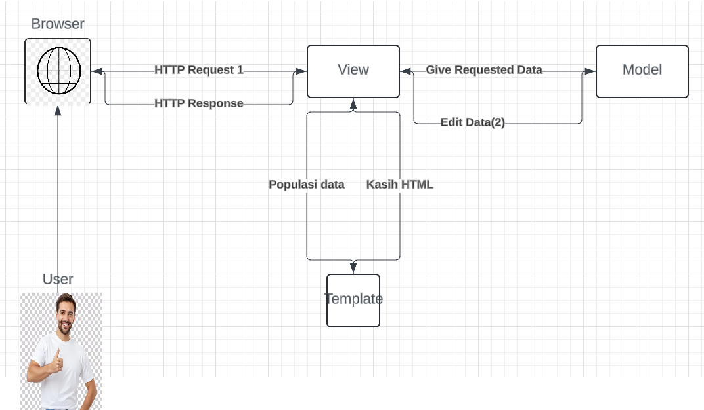
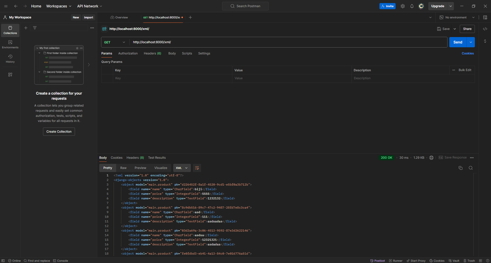
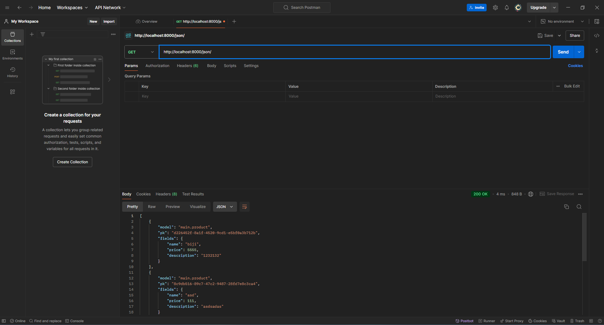
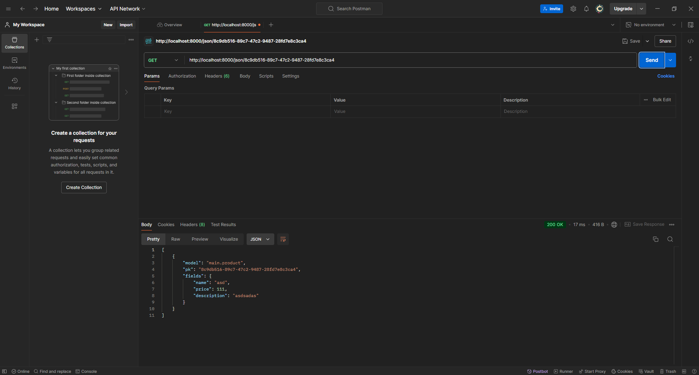

# albinstore

https://malvin-rheinaldy-albinstoree.pbp.cs.ui.ac.id/


<details>
<summary> <b> Tugas 2: Implementasi Model-View-Template (MVT) pada Django </b> </summary>
   
## Bagaimana cara mengimplementasi Tugas

### 1. Cara membuat Repositori baru
1. Buatlah sebuah direktori baru di komputer anda
2. Inisialisasi repositori dan hubungkan dengan GitHub
   ```bash
   git init
   git remote add origin <URL>
   git add .
   git commit -m "Initial commit"
   git push origin master
   ```
### 2. Menjalankan virtual enviorment
1. Jalankan perintah berikut dalam cmd/Powershell dalam direktori sebelumnya
   ```bash
   python -m venv env
   ```
2. Aktifkan virtual enviorment yang tadinya dibuat
      - **Windows**:
         ``` bash
         env\Scripts\activate
         ```
    - **Mac/Linux**:
      ``` bash
      source env\Scripts\activate
      ```
### 3.Menyiapkan dependencies/requirements
1. Dalam direktori yang sama buatlah sebuah berkas `requirements.txt` dan tambahkan beberapa dependencies
    ```bash
    django
    gunicorn
    whitenoise
    psycopg2-binary
    requests
    urllib3
    ```
2. Jalankan perintah berikut ini agar dapat menginstall dependenciesnya
   ```bash
   pip install -r requirements.txt
   ```
### 4. Membuat proyak Django baru
1. Buatlah sebuah proyek Django baru dengan nama `<name>`:
   ```bash
   django-admin startproject <name>
   ```
2. Membuat folder baru bernama main:
   ```bash
   django-admin startapp main
   ```
### 5. Membuat template 
1. Tambahkan kode berikut pada `views.py`
   ```bash
    from django.shortcuts import render

    def show_main(request):
      context = {
        'name_aplikasi': 'albinstore',
        'name': 'Alvin',
        'npm' : '2306275866',
        'class': 'PBP D'
    }
      return render(request, "main.html", context)
   ```
2. Pada `urls.py`, tambahkan `path('', include(`main.urls`))` pada `urlpatterns` agar URL pada `main` bisa diakses
3. Pada folder `main`, buatlah sebuah folder baru bernama `templates` dan di dalam folder ini buatlah sebuah file bernama `main.html` yang menampilkan data-data yang kita butuhkan

### 6. Mengubah berkas `models.py`
1. Di `models.py`, buat model produk dengan atribut berikut:
   - `name`
   - `price`
   - `description`
### 7. Melakukan migration
1. Pada terminal balik kepada folder/directory utama
2. Jalankan proses migration pada terminal
   ```bash
   python manage.py makemigrations
   python manage.py migrate
   ```

### 8. Deploy ke Pacil Web Service
1. Buat proyek baru dengan menekan tombol `Create New Project`. 
2. Setelah menekan tombol tersebut isilah nama project dengan sesuai keinginan.
3. Kemudian akan ada `Project Credential` simpanlah `Credentials` ini dalam folder luar.
4. Pada file `settings.py`, tambahkan `<URL Deployment Kamu>`, kedalam list `ALLOWED_HOSTS`.
   - **Notes**
     format URL PWS pada umumnya adalah
      ```bash
      <username-sso>-<nama proyek>.pbp.cs.ui.ac.id
      ```
5. Simpan semua perubahan dengan menjalankan perintah ini dalam terminal/command center
   ```bash
    git add .
    git commit -m "Deploy to PWS"
    git push origin master
   ```
6. Kemudian masukkan remote PWS dalam terminal
   ```bash
   git remote add pws <url>
   git branch -M master
   git push pws master
   ```

### 9. Selesai!
Aplikasi bisa diakses dengan URL yang kamu pilih!

# Bagan request client dan responsnya



## Penjelasan

 1. User melakukan HTTP request yang ditangani oleh View: URL yang diminta oleh user diproses melalui urls.py, yang menentukan function View di views.py yang akan dijalankan.
 2. View me-request data dari Model: Function View akan mengambil data yang diperlukan dari model di models.py berdasarkan data field yang telah ditentukan.
 3. View me-request Template yang dipopulasikan data: Berdasarkan function View, berkas HTML tertentu akan dipilih dari Template, kemudian View mengirimkan HTML yang sudah diisi data tersebut sebagai HTTP response kepada user.

# Jelaskan fungsi git dalam pengembangan perangkat lunak!

Git digunakan untuk melakukan version control dan agar dapat melihat apa saja yang ditambahkan pada proyek pada waktu tertentu yang terekam. Git juga dapat membantu kita dalam proses kolaborasi
dan juga dapat memungkinkan rollback ke versi-versi yang sebelumnya sudah di upload.

# Menurut Anda, dari semua framework yang ada, mengapa framework Django dijadikan permulaan pembelajaran pengembangan perangkat lunak?

Django dijadikan permulaan pembelajaran karena mudah dipelajari, terstruktur, memiliki fitur lengkap, aman, dan didukung komunitas besar serta dapat digunakan untuk aplikasi skala besar.

# Mengapa model pada Django disebut sebagai ORM?

Karena memungkinkan programmer untuk berinteraksi dengan basis data menggunakan Python, sehingga data yang disimpan di tabel-tabel basis data relasional dapat diakses dan dimanipulasi seolah-olah mereka adalah objek dalam kode, tanpa perlu menulis query SQL secara langsung.

</details>

   
<details>
<summary> <b> Tugas 3: Implementasi Form dan Data Delivery pada Django </b> </summary>
   
### Jelaskan mengapa kita memerlukan data delivery dalam pengimplementasian sebuah platform?
   
Dalam proses mengimplementasi sebuah platform data delivery sangatlah penting dikarenakan data delivery ini adalah hal penting dari komunikasi antar komponen dalam sistem dan interaksi dengan pengguna. Selain itu data delivery digunakan juga untuk memastikan aliran data yang konsisten, optimasi performa sistem, menjaga keamanan pengguna.
   
### Menurutmu, mana yang lebih baik antara XML dan JSON? Mengapa JSON lebih populer dibandingkan XML?

| Format       | XML                                                                 | JSON                                                                                     |
|--------------|---------------------------------------------------------------------|------------------------------------------------------------------------------------------|
| Perbandingan |Menggunakan tag yang mirip dengan HTML untuk menyusun data dalam bentuk elemen-elemen yang berpasangan. XML menggunakan tag yang memisahkan nama data dan nilai data. |  Menggunakan format yang lebih sederhana dan ringan dengan struktur yang terdiri dari pasangan kunci (key) dan nilai (value). |
| Sintaks      | `<tag>isi</tag>`                                                  | `{nama: '<input nama>'}` 

### Jelaskan fungsi dari method is_valid() pada form Django dan mengapa kita membutuhkan method tersebut?

Method ini adalah method otomatis dan digunakan untuk memvalidasi data yang dikirimkan melalui form.

### Mengapa kita membutuhkan csrf_token saat membuat form di Django? Apa yang dapat terjadi jika kita tidak menambahkan csrf_token pada form Django? Bagaimana hal tersebut dapat dimanfaatkan oleh penyerang?

Penggunaan csrf_token merupakan langkah keamanan penting dalam menggunakan Django, dikarenakan jika tidak menggunaan ini, aplikasi kita dapat diberi permintaan palsu dari pihak yang tidak diinginkan yang dapat menggunakan sesi pengguna yang aktif untuk melakukan tindakan kriminal.

### Jelaskan bagaimana cara kamu mengimplementasikan checklist di atas secara step-by-step (bukan hanya sekadar mengikuti tutorial).

### Implementasi skeleton

1. Membuat folder bernama `templates` di folder utama(`root directory`).
2. Dalam folder `templates` buat `base.html` yang berisi berikut:
   ```
   
   <!DOCTYPE html>
   <html lang="en">
     <head>
       <meta charset="UTF-8" />
       <meta name="viewport" content="width=device-width, initial-scale=1.0" />
        
     </head>

     <body>
        
     </body>
   </html>
   ```
3. Pada `settings.py` dalam folder `albinstore` tambahkan `DIRS` dalam `TEMPLATES`
   ```
   'DIRS': [BASE_DIR / 'templates'],
   ```


### Implementasi UUID

1. Dalam folder `main` bukalah `models.py` ubahlah menjadi
   ```
   import uuid
   
   class Product(models.Model):
    id = models.UUIDField(primary_key=True, default=uuid.uuid4, editable=False)
    name = models.CharField(max_length=255)
    price = models.IntegerField()
   ```
2. Migrasi dengan menjalankan command
   ```
    python3 manage.py makemigrations
    python3 manage.py migrate
    ```

### Membuat form penambahan objek

1. Dalam folder `main` buatlah folder `forms.py` yang diisi
   ```
   from django.forms import ModelForm
   from main.models import Product

   class ProductEntryForm(ModelForm):
       class Meta:
           model = Product
           fields = ["name", "price", "description"]
   ```
2. Dalam folder `main/template` buatlah `create_product_entry.html` yang berisi
   ```
    
   
   <h1>Add New Product Entry</h1>

   <form method="POST">
     
     <table>
       {{ form.as_table }}
       <tr>
         <td></td>
         <td>
           <input type="submit" value="Add Product Entry" />
         </td>
       </tr>
     </table>
   </form>

   
   ```
3. Dalam `views.py` dalam folder yang sama saya menambahkan function baru yaitu
   ```
   def create_product_entry(request):
    form = ProductEntryForm(request.POST or None)

    if form.is_valid() and request.method == "POST":
        form.save()
        return redirect('main:show_main')

    context = {'form': form}
    return render(request, "create_product_entry.html", context)
   ```
4. Lalu dalam file yang sama dalam function `show_main` saya menambahkan edit
   ```
   def show_main(request):
      product_entries = Product.objects.all()

      ...

      'product_entries': product_entries
   ```

5. Lalu saya mengubah `main.html` dalam direktori `template`
   ```
   
   
   <h1>albinstore</h1>

   <h5>NPM: </h5>
   <p>{{ npm }}<p>

   <h5>Name:</h5>
   <p>{{ name }}</p>

   <h5>Class:</h5>
   <p>{{ class }}</p>

   
   <p>Belum ada product pada toko ini.</p>
   
   <table>
     <tr>
       <th>Name</th>
       <th>Price</th>
       <th>Description</th>
     </tr>

      Berikut cara memperlihatkan data mood di bawah baris ini 
      
     
     <tr>
       <td>{{product_entry.name}}</td>
       <td>{{product_entry.price}}</td>
       <td>{{product_entry.description}}</td>
     </tr>
     
   </table>
   

   <br />

   <a href="">
     <button>Add New Product Entry</button>
   </a>

   
   ```

### Return data dalam bentuk XML & JSON

1. Dalam folder `main`  mengedit `views.py` dengan manambahkan
   ```
   from django.http import HttpResponse
   from django.core import serializers
   ```
2. Lalu menambahkan function baru untuk bisa mengambil XML & JSON
   ```
   def show_xml(request):
    data = Product.objects.all()
    return HttpResponse(serializers.serialize('xml', data), content_type='application/xml')

   def show_json(request):
    data = Product.objects.all()
    return HttpResponse(serializers.serialize('json', data), content_type='application/json')
   ```
3. Lalu cara mengembalikan data XML & JSON dengan ID dilakukan dengan cara menambahkan function seperti
   ```
   def show_xml_by_id(request, id):
    data = Product.objects.filter(id=id)
    return HttpResponse(serializers.serialize('xml', data), content_type='application/xml')

   def show_json_by_id(request, id):
    data = Product.objects.filter(id=id)
    return HttpResponse(serializers.serialize('json', data), content_type='application/json')
   ```

4. Dalam folder yang sama bukalah `urls.py` lalu masukkan
   ```
   from main.views import show_main, create_product_entry, show_xml, show_json, show_xml_by_id, show_json_by_id
   ```
5. Dalam `urlpatterns` tambahkan
   ```
   urlpatterns = [
    ...
    path('create_product_entry/', create_product_entry, name='create_product_entry'),
    path('xml/', show_xml, name='show_xml'),
    path('json/', show_json, name='show_json'),
    path('xml/<str:id>/', show_xml_by_id, name='show_xml_by_id'),
    path('json/<str:id>/', show_json_by_id, name='show_json_by_id'),
    ...
   ]
   ```

### Lakukan push ke github
```
git add .
git commit -m"<Commit message>"
git push origin main
git push pws master
```

### Screenshots

1. XML
   

2. XML by id
   

3. JSON
   

4. JSON by id
   
   
   
   
   

   
